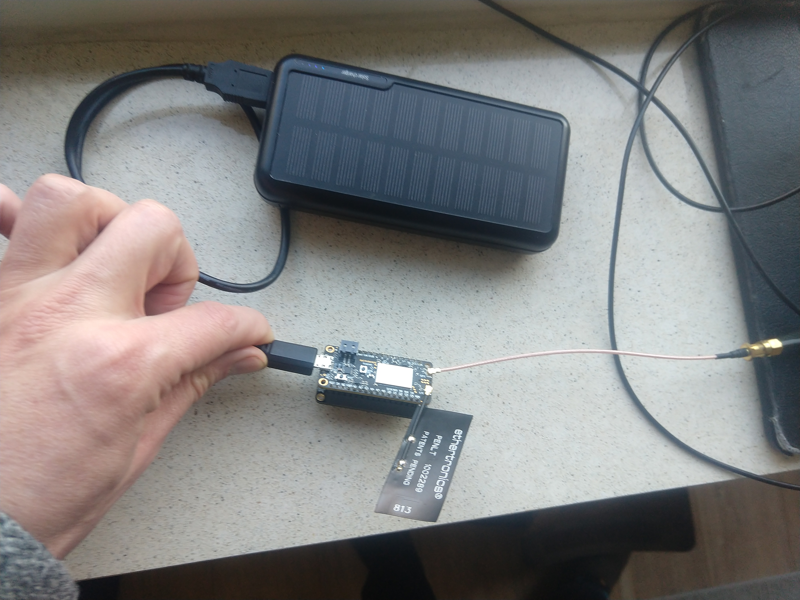

# Low-cost GNSS interferometry with the Actinius Icarus board and a Featherwing SDcard datalogger

R. Rietbroek 2023, r.rietbroek@utwente.nl

[GNSS- interferometry](https://link.springer.com/article/10.1007/s10291-018-0744-8) is gaining popularity as a technique to measure surface properties such as soil moisture, snow as well as well as a method to estimate the height of the gnss antenna above a reflecting surface such as a lake or a river.

Building GNSS_reflectometers can be done using, relatively expensive, geodetic grade equipment. However the abundance of commercial low-cost GNSS enabled devices on the market opens up possibilities to construct low-cost GNSS reflectometers from off-the shelf products.

This repository hosts the code and instructions to to build a low cost GNSS reflectometer based on the [actinius-icarus board](https://www.actinius.com/icarus)
which has an [Adafruit featherwing data logger](attached to enable the logging of GNSS data). The Actinius board hosts a [Nordic nrf9160 chip](https://www.nordicsemi.com/Products/nRF9160).

This particular setup has several advantages:
* The low-power nature of the Actinius icarus board makes it energy efficient and suitable to run on battery packs
* The LTE-M functionality allows automatic uploading of data files through a LTE-M network, allowing flexible deployment and remote monitoring capabilities.
* It's cheap (order of 200€)
Fromea long-term perspective, there are a few other advantages which justify developing this:
* The firmware is based on [zephyr](https://www.zephyrproject.org/), which is an active project allowing modular builds on various embedded platforms. This increases the chances on portability of the software to other platforms
* The ESIM functionality potentially allows changing network plans remotely, there is no need to replace a simcard
* An over-the-air firmware update is principle possible allowing remote management capabilities
* Potential to add more sensors through the featherwing interface



# Release history

## First release 1.0 for Icarus v1.4 29 March 2023
### Remarks (known issues)
* The TLS certificate authority certficate is currently hard-baked in the firmware, allowing file uploads through webdav to surfdrive.surf.nl, even though the configuration shows a tls certificate. If you want uploading functionality to a different server a rebuild is needed with a different TLS certicate. The intention is to change this in later releases so users can supply their own certificate through the [configuration file](config/config.json.default).
* The current software assumes that an external sim card is used. Using the onboard esim requires a rebuild of the firmware 
* The Actinius Icarus (v1.4.4) which was used to test the firmware had its modem firmware updated from version v1.2.3 to v1.2.7. Running the firmware on a platform with v1.2.3 modem version wil probably work unless some newer TLS ciphers are requested which were not on v1.2.3.  A mcuboot firmware version which [allows upgrading the modem firmware through uart](https://github.com/nrfconnect/sdk-nrf/tree/f18f6929e239f01125d349dc8543c940b45b2001/samples/nrf9160/fmfu_smp_svr) for the Icarus v1.4 is supplied [in the firmware_img directory](firmware_img/fmfu_smp_svr_icarusv1.4_app_update.bin)
*  A little [hack has been applied to `zephyr/subsys/disk/disk_access_spi_sdhc.c`](https://community.jaredwolff.com/d/52-sd-card-writing-speed-issue/14) which set SDHC_SPI_SPEED  and SDHC_SPI_INITIAL_SPEED to MHZ(8). This sped up the reading and writing to and from the sdcard. Note that the maximum SPI frequency supported by the nrf9160 is 8 MHz.
* The firmware for this version is build using [the 1.5.1 nrf Buildchain] (https://developer.nordicsemi.com/nRF_Connect_SDK/doc/1.5.1/nrf/index.html)


# Installation and Usage
## Flashing the firmware through mcumgr
**WARNING** Make sure that the firmware is suitable for the platform version and modem firmware version. The firmware has note been ported yet for newer versions (> 1.4) of the Actinius Icarus board (status March 2023). The current images also use the old partition offsets as described [here](https://docs.actinius.com/getting-started/flashing-an-application). 

Currently, the [firmware_img directory](firmware_img) only holds the firmware binaries (`*app_update.bin`) which can be flashed with the [mcumgr utility](https://docs.zephyrproject.org/latest/services/device_mgmt/mcumgr.html). This has the advantage that no J-link device is needed and one can directly flash the board through a usb port. It does require that a mcuboot system is installed on the device (this is the case when it comes from the factory). For further details have a look [here](https://docs.actinius.com/getting-started/flashing-an-application).

With mcumgr properly installed, you can upload the firmware to the Actinius board:
1. Connect the board to the USB port on your PC and figure out the corresponding tty device (usually `/dev/ttyUSB0`, but this can differ)
2. Put the Icarus board in mcuboot mode by: press and hold the reset button, then press and hold the user button and then release the reset button.

You can see whether the board is in mcuboot boot by listing the populated images on the board:

`mcumgr --conntype="serial" --connstring="dev=/dev/ttyUSB0,baud=115200" image list`
, connected to a usb port, using `mcumgr`:

3. You can then proceed to flash the application by executing:

`mcumgr --conntype="serial" --connstring="dev=/dev/ttyUSB0,baud=115200" image upload firmware_img/gnssrv1.0_icarusv1.4_mfw1.2.7_app_update.bin`


## Formatting a micro-sd card 
The Featherwing data logger can recognize a micro-sd card, but the firmware assumes that a vfat filesystem is initiated. So before the first insertion of the micro-sd card, make sure that it is formatted with a vfat filesystem. There are several tools which can do this, on linux I prefer [gparted](https://gparted.org/).

## Led indicators & running the board
Once inserted and flashed you can (re)start the board by pressing the reset button. The color and frequency of the leds give hints of the operational status:

* blinking red (every 10 seconds): an error occurred
* blinking yellow(ish) every 10 seconds: the device is trying to obtain a satellite fix
* Tiny green flash every 10 seconds: the device is logging GNSS messages
* Blinking blue every 5 seconds: the device is rolling over the log and uploading files

As a user, you can initiate a log-rollover (e.g. closing the current logfile and initiate an upload) **by pressing the user button while in operation**.

To save on storage and bandwidth, the logs are compressed in [lz4 format](https://lz4.github.io/lz4/). Better compression algorithms exist but these would need more processing power.


## Changing the JSON configuration
After a first run on a fresh sdcard, configuration and data directories will be created on tthe sd-card. In addition, a [configuration file with defaults](config/config.json.default) will be written to the `config` directory. The configuration file can be adjusted to your needsi, by e.g. setting `"upload": 0` will prevent uploading attempts.


## Debugging the board output by displaying the uart serial output 
When the board is connected to the USB port of a PC, you can capture the serial USB output for debugging. This can be done using several methods, but for your convenience a [command line tool](debugtools/catserial.sh) is provided. The information displayed contains several start up messages, possibly the IMEI and CCID numbers of the internal ESIM (if it is selected) and indication of satellites tracked and GNSS logging status.

The correct settings  for the serial connection are:
- baud rate: 115200
- data bits:8
- stop bit: 1
- parity: None
- Flow control: None

# Building the firmware yourself
There are several instructions for installing the SDK and building Zephyr binaries. The version here is a summary of the command line version using `west` and `mcumgr` 

Building this firmware requires [installing the v1.5.1 version of the Software Development Kit from Nordic](https://developer.nordicsemi.com/nRF_Connect_SDK/doc/latest/nrf/getting_started.html). Which is an extended version of the Zephyr development kit. For the discussion here, it is assumed that the development kit is installed in the user's home under ncs `${HOME}/ncs`.

## Using a dedicated python environment
The current stack was build by setting up a dedicated python environment [using the command line interface to the zephyr build system](https://developer.nordicsemi.com/nRF_Connect_SDK/doc/latest/nrf/gs_installing.html#set-up-the-command-line-build-environment).

After following the instructions from the link above and downloading version v1.5.1 of the Nrdic Software development Kit (nrf-sdk), some modifications can be done such that `west` will find the Zephyr codei and toolchain from the `${HOME}/ncs` directory:

Once a new python environment is created `python -m venv pynrf` in the users home, one can  add the following to the bottom of ${HOME}/pynrf/bin/activate

```
source ${VIRTUAL_ENV}/nrfenvs
```

The file `nrfsenvs` should be constructed in `${HOME}/pynrf/bin` and contains instructions to find the zephyr-sdk environment and the toolchain:
```
source ${HOME}/ncs/zephyr/zephyr-env.sh
```

## Building the firmware 
From a terminal which has loaded the `pynrf` environment, change to the `firmware_src` directory of this repository and execute

`west build -b actinius_icarus_ns -d build`

or 

`west build -b actinius_icarus_ns -d build --pristine` 

When all the filed in the build directory needs to be overwritten. If all goes well, this should create a new firmware image `firmware_src/build/zephyr/app_update.bin`, which can be flashed using `mcumgr`.


# TODO: Software

1. ~~Setup communication with the sdcard from the data logger (uses SPI3 protocol)~~
2. Setup the setting of the clock on the datalogger (uses a serial connection on i2c of the feather board). possibly use GPS nmea messages to set the time (every once in a while?)
3. ~~Allow writing of lz4 compressed files to the sdcard (to store nmea messages, and telemetry)~~
4. ~~Add functionality to upload nmea logs to an external server using the on board LTE chip~~
5. Add functionality to do a remote over-the air update of the firmware
6. ~~Read privacy sensitive settings from configuration file (such as upload passwords etc.)~~
7. Filter nmea GSV messages based on an azimuth/elevation mask to reduce file size
8. Upload status messages to a MTQQ server

# TODO: Hardware
1. Write [instructions for putting together the recorder](building_instructions/README.md)
2. Assemble battery, charger and solar panel, in a waterproof outdoor case


